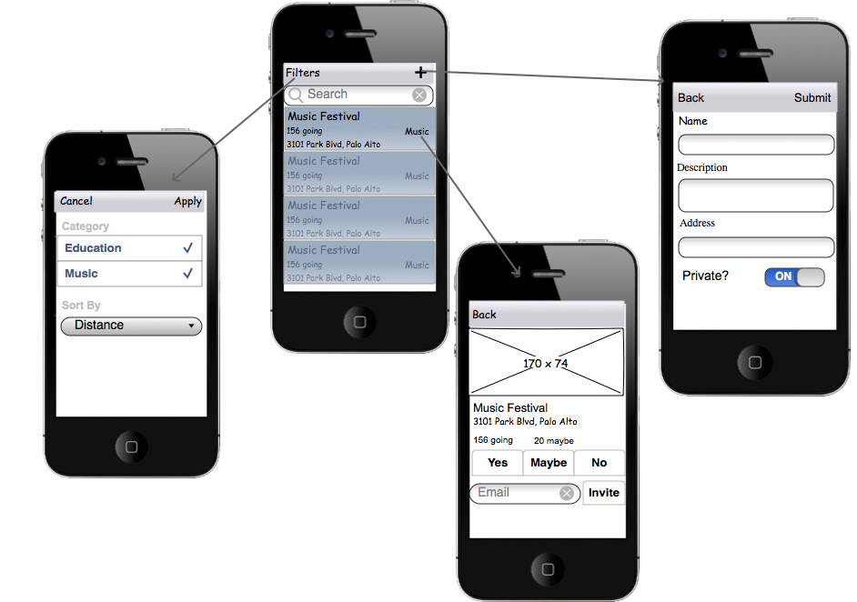

# Nearby

There are so many interesting events happening around the world but it is not easy to find them easily. 'Nearby' can help people explore events that are happening nearby and also RSVP to an event. 'Nearby' also lets users create their own public / private events and invite people.

## User Stories

The following **required** functionality will be completed

* [x] User can view a list of events he's invited to and respond to each event
* [x] User can view a list of events nearby and rsvp to each
* [x] User can create new events (public or private) and invite people
* [x] User can go to the event detail page where one can view list of users, location and other info

The following **optional** features will be implemented:
* [ ] Users can send friend requests
* [x] Users can chat inside events
  * [ ] Users can post photos
* [ ] Users can swipe to RSVP an event
* [ ] User can filter events by date, type, number of people attending
* [ ] Users can customize the response
* [ ] User can view the events in a map view
* [ ] Users can peek an event for preview and pop to go to the event detail

## Wireframe

